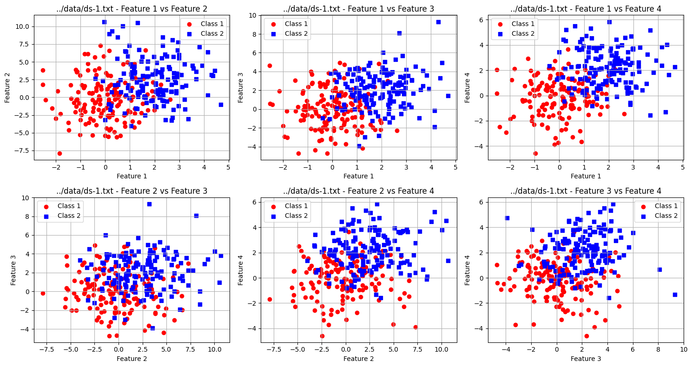
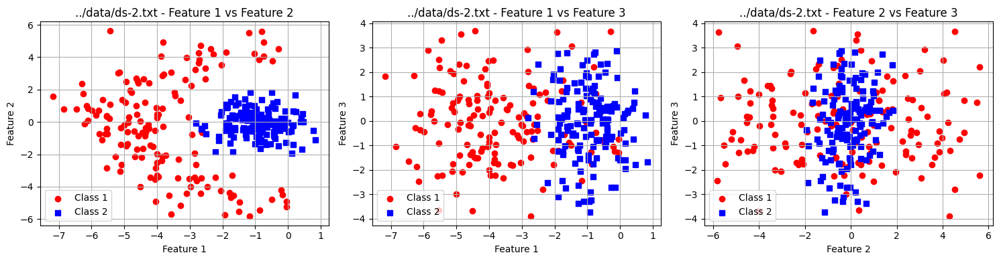
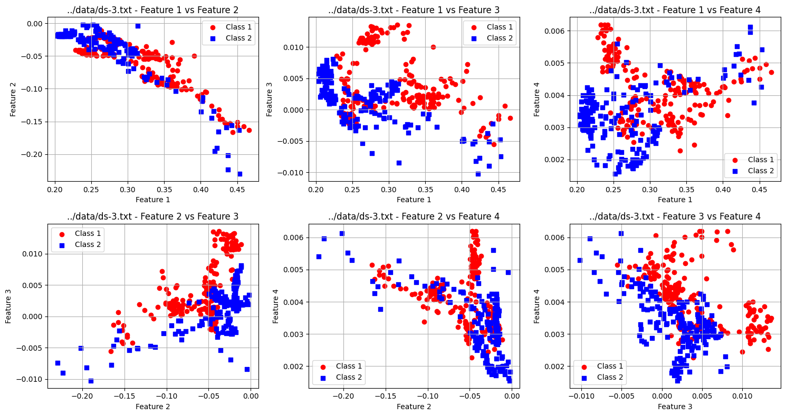
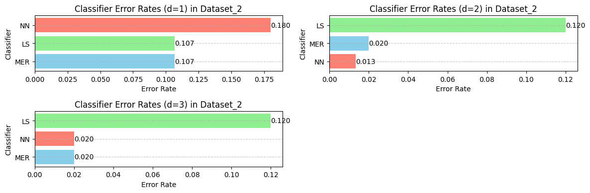
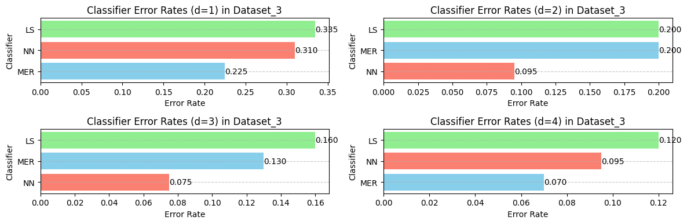

# Project Assignment 1
## TEK5020/9020 – Pattern Recognition
### Autumn 2024

### Table of Contents
1. [Introduction](#1-introduction)
2. [Datasets](#2-datasets)
3. [Theory](#3-theory)
   1. [Minimum Error Rate Classifier](#31-minimum-error-rate-classifier)
   2. [Least Squares Method](#32-least-squares-method)
   3. [Nearest Neighbor Classifier](#33-nearest-neighbor-classifier)
4. [Training of Classifiers](#4-training-of-classifiers)
5. [Results](#5-results)
   1. [Feature Combination Rankings](#51-feature-combination-rankings)
   2. [Classifier Rankings](#52-classifier-rankings)
   3. [Discussion](#53-discussion)
6. [Conclusion](#6-conclusion)

## 1. Introduction
In this project it is implemented three different classifiing algorithms being 
- Nearest Neighbors (NN)
- Least Squares (LS)
- Minimum error rate (MER)

A classifier is then trained for each three datasets being splitted in train and test sets as described in the project description.

For the first part each classifier is implemented and trained on the datasets 1 for using all features. 
For the code implementaition of the classifiers, refer to the [GitHub](https://github.com/javidaf/TEK5020-P1/blob/master/tek5020_p1/classifiers.py) repository module. 

For the second part, for each datasett nearest neighbors classifier is used to find the error rate for all combinations of features as described in  section five of the project description.

Then for the combination of features with the lowest error rate, a ranking of the the classifiers is done based on the error rate estimate.

## 2. Datasets
The datasets used are:
- **Dataset 1**: 300 objects with 4 features.
- **Dataset 2**: 300 objects with 3 features.
- **Dataset 3**: 400 objects with 4 features.

Each dataset is split into training and test sets, with odd-numbered objects in the training set and even-numbered objects in the test set.

<a id="dataset1"></a>
**Dataset 1**:


<a id="dataset2"></a>
**Dataset 2**:


<a id="dataset3"></a>
**Dataset 3**:


## 3. Theory

### 3.1 Minimum Error Rate Classifier
This classifier assigns an object with feature vector $\vec{x}$ to class $\omega_k$ if

```math
P(\omega_k|\vec{x}) = \max_{i} P(\omega_i|\vec{x}), \quad i = 1, \dotsc, c
```

where $c$ is the number of classes. Assuming normally distributed class-conditional density functions, we obtain the discriminant functions

```math
g_i(\vec{x}) = \vec{x}^T W_i \vec{x} + \vec{w}_i^T \vec{x} + w_{i0}
```

where

```math
W_i = -\frac{1}{2} \Sigma_i^{-1} \tag{1}
```

```math
\vec{w}_i = \Sigma_i^{-1} \vec{\mu}_i \tag{2}
```

and

```math
w_{i0} = -\frac{1}{2} \vec{\mu}_i^T \Sigma_i^{-1} \vec{\mu}_i - \frac{1}{2} \ln |\Sigma_i| + \ln P(\omega_i) \tag{3}
```

Here, $\Sigma_i$ and $\vec{\mu}_i$ are the covariance matrix and the mean vector of class $\omega_i$, respectively. These quantities are usually unknown and must be estimated from the training data. Here, the maximum likelihood method should be used to estimate these quantities. This means that the mean vector and covariance matrix of class $\omega_i$ are estimated as

```math
\hat{\vec{\mu}}_i = \frac{1}{n_i} \sum_{j=1}^{n_i} \vec{x}_{ij}
```

and

```math
\hat{\Sigma}_i = \frac{1}{n_i} \sum_{j=1}^{n_i} (\vec{x}_{j} - \hat{\vec{\mu}}_i)(\vec{x}_{j} - \hat{\vec{\mu}}_i)^T
```

where $n_i$ is the number of objects in the training set for class $\omega_i$ and $\vec{x}_{j}$ is the feature vector of object $j$ in class $\omega_i$.

Because we are only considering two-class problems here, we can use

```math
g(\vec{x}) = g_1(\vec{x}) - g_2(\vec{x})
```

as the discriminant function. With this, $\vec{x}$ is assigned to class $\omega_1$ if $g(\vec{x}) > 0$ and to class $\omega_2$ otherwise.

As part of the project assignment, you should create a function that trains a minimum error rate classifier as outlined above. You need to create a function that, based on the training objects, calculates the matrices $W_i$, vectors $\vec{w}_i$, and constants $w_{i0}$ as given in equations (1), (2), and (3) for $i = 1, 2$. Since the prior probabilities $P(\omega_i)$ included in equation (3) are unknown here, they must be estimated based on the number of training objects from each class in the dataset.

The function should be used to construct classifiers for selected feature combinations from all three datasets.

### 3.2 Least Squares Method
This method yields a linear classifier with a discriminant function given by

```math
g(\vec{x}) = \vec{a}^T \vec{y} \tag{4}
```

where $\vec{a} = [a_0, a_1, a_2, \dotsc, a_n]^T$ is the extended vector of weights and $\vec{y} = [1, x_1, x_2, \dotsc, x_n]^T$ is the extended vector of features. Let $\vec{Y}$ be a matrix of dimension $n \times (d+1)$, which contains all the extended training vectors stored row-wise, i.e.,

```math
\vec{Y} = \begin{bmatrix}
1 & x_{11} & x_{12} & \dotsb & x_{1n} \\
1 & x_{21} & x_{22} & \dotsb & x_{2n} \\
\vdots & \vdots & \vdots & \ddots & \vdots \\
1 & x_{n1} & x_{n2} & \dotsb & x_{nn}
\end{bmatrix}
```

Further, we define an $n$-dimensional vector $\vec{b} = [b_1, b_2, \dotsc, b_n]^T$ where each element $b_i$ is given as $b_i = 1$ for $\vec{y}_i$ in class $\omega_1$ and $b_i = -1$ otherwise.

The vector $\vec{a}$ is now chosen such that the length of the error vector $\vec{e} = \vec{Y} \vec{a} - \vec{b}$ is minimized. That is, the cost function:

```math
J(\vec{a}) = \vec{e}^T \vec{e} = (\vec{Y} \vec{a} - \vec{b})^T (\vec{Y} \vec{a} - \vec{b})
```

is minimized. This can be done by solving the normal equation

```math
\vec{Y}^T \vec{Y} \vec{a} = \vec{Y}^T \vec{b}
```

In other words, you should write a function that, based on the **training objects**, calculates the vector $\vec{a}$ for an arbitrary combination of features, so that the classifier is then given by the discriminant function $g(\vec{x}) = \vec{a}^T \vec{y}$ (equation 4).

### 3.3 Nearest Neighbor Classifier
This is a computationally simple classifier that simultaneously provides good and reliable classifications. For each object $\vec{x}$ to be classified, the distance to all training objects in the training set is calculated, and $\vec{x}$ is assigned the same class as the nearest training object $\vec{x}_k$, where the distance is given by

```math
\|\vec{x} - \vec{x}_k\| = \min_{i} \|\vec{x} - \vec{x}_i\|
```


## 4. Training of Classifiers
The classifiers were trained on the training sets and evaluated on the test sets. The evaluation metric used is the error rate estimate.

## 5. Results

### 5.1 Feature Combination Rankings
For each dataset, the nearest neighbor classifier was used to estimate the error rate for all combinations of features. The best feature combinations for each dataset are as follows:

- **Dataset 1**:
  - Best combination (d=1): Feature 0 with NN error rate 0.24
  - Best combination (d=2): Features 0, 3 with NN error rate 0.1667
  - Best combination (d=3): Features 0, 1, 3 with NN error rate 0.1
  - Best combination (d=4): Features 0, 1, 2, 3 with NN error rate 0.0933

- **Dataset 2**:
  - Best combination (d=1): Feature 0 with NN error rate 0.18
  - Best combination (d=2): Features 0, 1 with NN error rate 0.0133
  - Best combination (d=3): Features 0, 1, 2 with NN error rate 0.02

- **Dataset 3**:
  - Best combination (d=1): Feature 1 with NN error rate 0.31
  - Best combination (d=2): Features 1, 2 with NN error rate 0.095
  - Best combination (d=3): Features 1, 2, 3 with NN error rate 0.075
  - Best combination (d=4): Features 0, 1, 2, 3 with NN error rate 0.095

### 5.2 Classifier Rankings
For the best feature combinations within each possible feature dimension, the classifiers were ranked based on their error rates.

- **Dataset 1**:
  - Best classifier (d=1): MER with error rate 0.18
  - Best classifier (d=2): MER with error rate 0.1133
  - Best classifier (d=3): MER with error rate 0.0867
  - Best classifier (d=4): LS with error rate 0.0733

- **Dataset 2**:
  - Best classifier (d=1): LS with error rate 0.1067
  - Best classifier (d=2): NN with error rate 0.0133
  - Best classifier (d=3): NN with error rate 0.02

- **Dataset 3**:
  - Best classifier (d=1): NN with error rate 0.31
  - Best classifier (d=2): NN with error rate 0.095
  - Best classifier (d=3): NN with error rate 0.075
  - Best classifier (d=4): MER with error rate 0.065

**Ranking models for Dataset 1**:


**Ranking models for Dataset 2**:



**Ranking models for Dataset 3**:




### 5.3 Discussion

The results demonstrate that the best-performing feature combinations and classifiers vary notably across datasets and feature dimensions. This variability highlights the importance of understanding dataset characteristics and choosing appropriate classifiers accordingly.

For [dataset 2](#dataset2), the Nearest Neighbor (NN) classifier clearly performs the best across all feature combinations, with significantly lower error rates than the other classifiers. This outcome can be attributed to the well-defined class boundaries observable in the feature plots of [dataset 2](#dataset2), particularly in the first two plots from the left. These plots show a distinct separation between Class 1 and Class 2, enabling the NN classifier to accurately categorize samples based on their proximity to training samples. This emphasizes the effectiveness of NN in scenarios where data points from different classes are spatially separated. NN doesn’t require linear boundaries and can adapt to complex shapes, making it suitable for [dataset 2](#dataset2)’s data structure.

In contrast, [dataset 1](#dataset1) demonstrates the limitations of the NN classifier. Here, NN consistently has the highest error rates across all feature combinations. The feature plots of [dataset 1](#dataset1) reveal a lack of clear boundaries between the two classes, with significant overlap between the data points of Class 1 and Class 2. This overlap leads to higher misclassification rates for NN, as proximity-based classification struggles in cases where class separation is ambiguous. The results underscore that NN classifiers are less effective when classes are not distinctly partitioned in feature space, as seen in [dataset 1](#dataset1).

For [dataset 3](#dataset3), the Minimum Error Rate (MER) classifier shows improved performance with the addition of more features. This trend suggests that MER can leverage the added dimensionality to better discern the underlying structure of the data. As more features are included, MER’s ability to model class distributions appears to enhance its performance, possibly due to capturing more complex patterns. The feature plots for [dataset 3](#dataset3) display some level of clustering, but with non-linear separations that likely benefit from MER’s probabilistic approach, allowing it to adapt to the gradual distinctions between classes as more features become available.

Across all datasets, Least Square (LS) displays mixed results, performing moderately well in certain cases but failing to match the effectiveness of NN in [dataset 2](#dataset2) or the robustness of MER in [dataset 3](#dataset3) with higher dimensions. LS may struggle in cases where the underlying decision boundaries are non-linear or irregular, as seen in [dataset 1](#dataset1) and [dataset 3](#dataset3).

## 6. Conclusion

1. **Why is it reasonable to use the nearest neighbor classifier to find favorable feature combinations?**
   The nearest neighbor classifier is non-parametric and makes minimal assumptions about the data distribution. This flexibility allows it to effectively evaluate the impact of different feature combinations on classification performance, identifying combinations that result in lower error rates without being constrained by predefined model structures.

2. **Why might it be reasonable in a practical application to find a linear or quadratic classifier to replace the nearest neighbor classifier?**
   Linear and quadratic classifiers are computationally more efficient, especially with large datasets, and often require less memory. Additionally, they provide explicit decision boundaries that are easier to interpret and implement in real-time applications. These classifiers can generalize better to unseen data and are less sensitive to noise compared to nearest neighbor classifiers.

3. **Why is it unfavorable to use the same dataset both for training and evaluation of a classifier?**
   Using the same dataset for both training and evaluation can lead to overfitting, where the classifier learns the noise and specific patterns of the training data instead of the underlying generalizable trends. This results in artificially low error rates during evaluation, which do not reflect the classifier's performance on new, unseen data.

4. **Why does a linear classifier give poor results for dataset 2?**
   A linear classifier performs poorly on dataset 2 because the data is poorly linearly separable, meaning that no straight line can effectively separate the classes. The classes overlap and intermingle, making it difficult for a linear classifier to accurately distinguish between them, leading to poor classification performance. On the other hand, the nearest neighbor classifier performed well on this dataset, having a very low error rate compared to the other classifiers. See [Ranking models for Dataset 2](#42-classifier-rankings).

